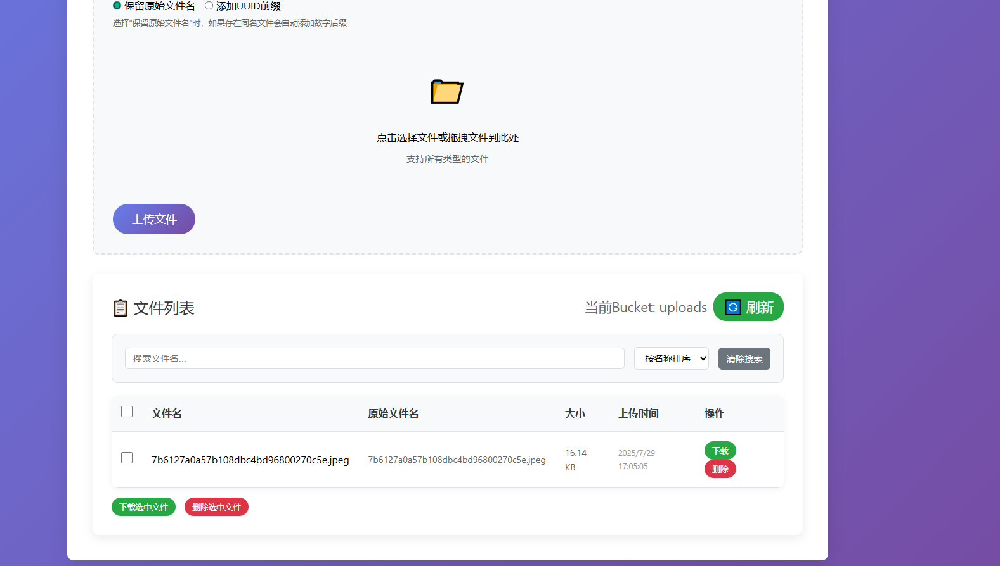
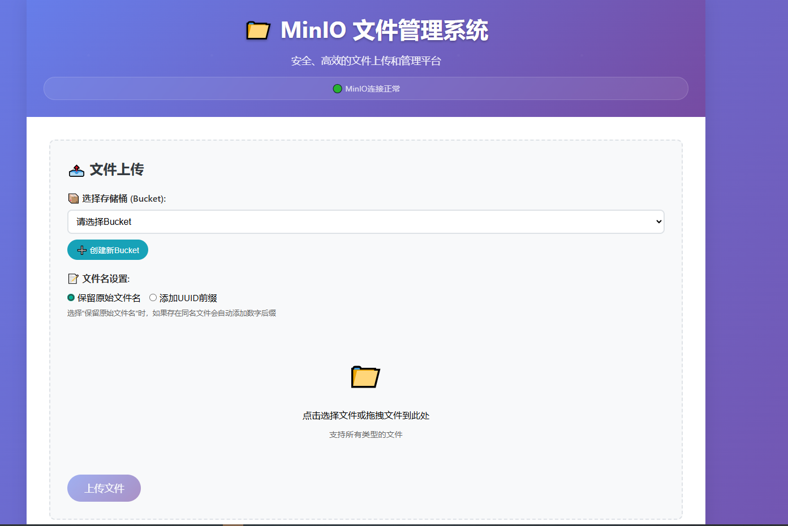

# MinIO Web Manager

[](https://www.python.org/)
[](https://flask.palletsprojects.com/)
[](https://min.io/)
[](LICENSE)
[](https://github.com/xuehaoweng/minio-web-manager)
[](https://github.com/xuehaoweng/minio-web-manager)

一个基于 Flask 和 MinIO 的现代化文件上传和管理 Web 应用。

## 📸 界面预览

### 文件上传界面


### 文件管理界面  


## 功能特性

- 📦 **Bucket管理**: 创建、选择和管理存储桶
- 📤 **文件上传**: 支持拖拽上传和点击选择文件
- 📝 **文件名控制**: 可选择保留原始文件名或添加UUID前缀
- 📋 **文件列表**: 实时显示所有上传的文件
- 🔍 **文件搜索**: 支持按文件名搜索和排序
- 📥 **文件下载**: 一键下载已上传的文件
- 🗑️ **文件删除**: 安全删除不需要的文件
- ⚡ **批量操作**: 支持批量下载和删除文件
- 🎨 **现代化UI**: 美观的响应式界面设计，支持深色模式
- 📱 **移动端适配**: 完美支持手机和平板设备
- 🔄 **实时进度**: 文件上传进度实时显示
- 📊 **系统监控**: 实时显示MinIO连接状态

## 🌟 项目特色

- 🎨 **现代化UI设计**: 美观的响应式界面，支持深色模式
- ⚡ **高性能**: 基于Flask的轻量级后端，快速响应
- 🔒 **安全可靠**: 支持文件类型检查，大小限制，安全上传
- 📱 **移动端适配**: 完美支持手机和平板设备
- 🌍 **国际化支持**: 中文界面，易于使用

## 环境要求

- Python 3.7+
- MinIO 服务器
- 现代浏览器

## 🚀 快速开始

### 1. 克隆项目
```bash
git clone https://github.com/xuehaoweng/minio-web-manager.git
cd minio-web-manager
```

### 2. 创建虚拟环境
```bash
python -m venv venv
```

### 3. 激活虚拟环境
```bash
# Windows
venv\Scripts\activate

# Linux/Mac
source venv/bin/activate
```

### 4. 安装依赖
```bash
pip install -r requirements.txt
```

### 5. 配置环境变量
编辑 `config.env` 文件，设置您的 MinIO 连接信息：

```env
# MinIO 配置
MINIO_ENDPOINT=http://ip:9000
MINIO_ROOT_USER=admin
MINIO_ROOT_PASSWORD=12345678
MINIO_BUCKET_NAME=uploads
MINIO_SECURE=false
```

### 6. 启动应用
```bash
python app.py
```

应用将在 `http://localhost:5000` 启动。

### 7. 访问应用
打开浏览器访问 `http://localhost:5000` 即可开始使用！

## 📖 使用说明

### 首次使用
1. 启动应用后，页面会自动连接到MinIO服务器
2. 如果没有Bucket，点击"创建新Bucket"按钮创建
3. 选择Bucket后即可开始上传和管理文件

### 文件上传
- 支持拖拽上传和点击选择文件
- 可选择保留原始文件名或添加UUID前缀
- 实时显示上传进度
- 支持文件类型和大小限制

### 文件管理
- 支持文件搜索和排序
- 批量下载和删除操作
- 显示文件大小和上传时间
- 支持所有文件类型下载

## 配置说明

### 环境变量

| 变量名 | 说明 | 默认值 |
|--------|------|--------|
| `MINIO_ENDPOINT` | MinIO 服务器地址 | `http://ip:9000` |
| `MINIO_ROOT_USER` | MinIO 用户名 | `admin` |
| `MINIO_ROOT_PASSWORD` | MinIO 密码 | `12345678` |
| `MINIO_BUCKET_NAME` | 存储桶名称 | `uploads` |
| `MINIO_SECURE` | 是否使用 HTTPS | `false` |

## API 接口

### 文件上传
- **URL**: `POST /upload`
- **参数**: 
  - `file` (文件)
  - `bucket_name` (存储桶名称)
  - `keep_original_name` (是否保留原始文件名: true/false)
- **返回**: JSON 格式的上传结果

### Bucket管理
- **获取Bucket列表**: `GET /buckets`
- **创建Bucket**: `POST /buckets`
  - **参数**: `{"bucket_name": "bucket名称"}`
- **返回**: JSON 格式的bucket信息

### 获取文件列表
- **URL**: `GET /files`
- **返回**: JSON 格式的文件列表

### 下载文件
- **URL**: `GET /download/<object_name>`
- **返回**: 文件内容

### 删除文件
- **URL**: `DELETE /delete/<object_name>`
- **返回**: JSON 格式的删除结果

## 使用说明

1. **上传文件**:
   - 点击上传区域选择文件
   - 或直接拖拽文件到上传区域
   - 点击"上传文件"按钮

2. **查看文件**:
   - 页面会自动加载文件列表
   - 点击"刷新"按钮手动更新列表

3. **下载文件**:
   - 在文件列表中点击"下载"按钮

4. **删除文件**:
   - 在文件列表中点击"删除"按钮
   - 确认删除操作

## 📁 项目结构

```
minio-web-manager/
├── app.py              # Flask 主应用
├── requirements.txt     # Python 依赖
├── config.env          # 环境变量配置
├── templates/          # HTML 模板
│   └── index.html     # 主页面
├── LICENSE             # MIT 开源协议
├── README.md          # 项目说明
└── .gitignore         # Git 忽略文件
```

## 故障排除

### 常见问题

1. **MinIO 连接失败**
   - 检查 MinIO 服务器是否运行
   - 验证连接地址和端口
   - 确认用户名和密码正确

2. **文件上传失败**
   - 检查网络连接
   - 确认 MinIO 存储桶存在
   - 验证文件大小是否超限

3. **页面无法访问**
   - 确认 Flask 应用正在运行
   - 检查端口是否被占用
   - 验证防火墙设置

## 开发说明

### 添加新功能

1. 在 `app.py` 中添加新的路由
2. 在 `templates/index.html` 中添加对应的前端功能
3. 更新 CSS 样式以保持界面一致性

### 自定义样式

编辑 `templates/index.html` 中的 `<style>` 部分来修改界面样式。

## 🤝 贡献指南

我们欢迎所有形式的贡献！

### 如何贡献
1. Fork 这个项目
2. 创建你的特性分支 (`git checkout -b feature/AmazingFeature`)
3. 提交你的更改 (`git commit -m 'Add some AmazingFeature'`)
4. 推送到分支 (`git push origin feature/AmazingFeature`)
5. 打开一个 Pull Request

### 报告问题
如果你发现了bug或有功能建议，请创建一个Issue。

## 📄 许可证

本项目采用 MIT 许可证 - 查看 [LICENSE](LICENSE) 文件了解详情。

## 🙏 致谢

- [Flask](https://flask.palletsprojects.com/) - Web框架
- [MinIO](https://min.io/) - 对象存储服务
- [Bootstrap](https://getbootstrap.com/) - CSS框架灵感

## ⭐ 如果这个项目对你有帮助

如果这个项目对你有帮助，请给它一个⭐️！

---

**Made with ❤️ by xuehaoweng** 